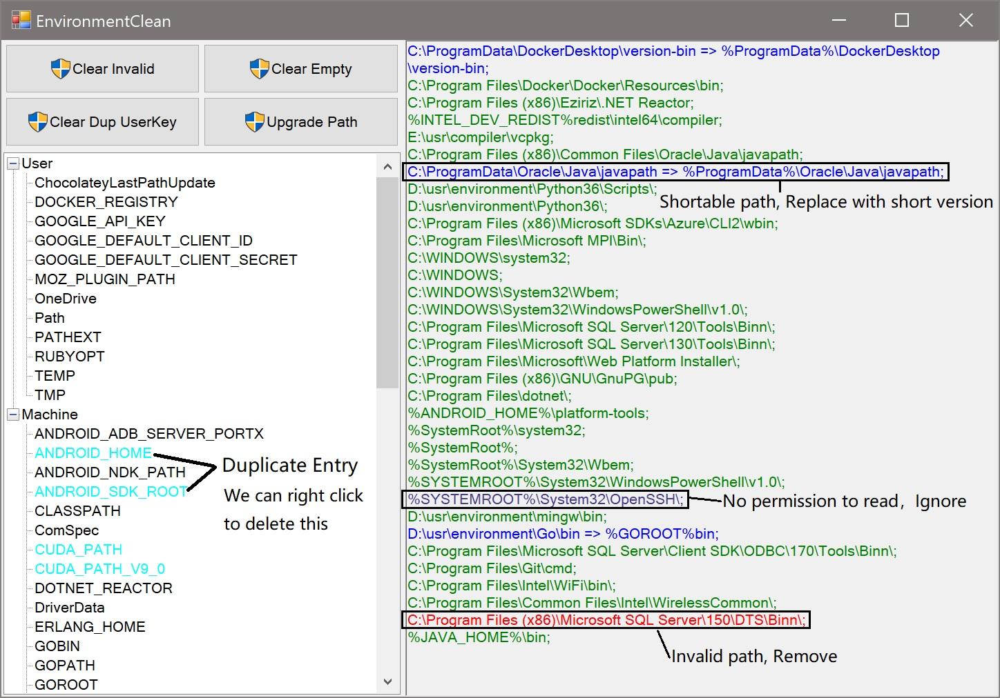

# EnvironmentClean

## About

This is a little tool can help us clean Windows environment variables.

This morning I opened the 'System Properties' => 'Environment Variables...' window

That long long long 'Path' environment shocked me, So maybe I can figure out these things first

## How to use

As shown in picture below

We can launch this application to view our environment variables, Click key to preview value

- When 'Clear Invalid' clicked, It will remove invalid entry (deleted file or directory)
- When 'Clear Empty' clicked, It will remove empty entry ("")
- When 'Clear Dup UserKey' clicked, It will remove the user variables exist in system variables (if System variables defined 'FOO' and User variables also defined, will remove User's entry)
- When 'Upgrade Path' clicked, It will rearrange 'Path' variable (remove invalid path and replace shortable entry)

Use these button directly are **not recommended**, even these operation can save backup file.

[中文说明](README_ZH.md)