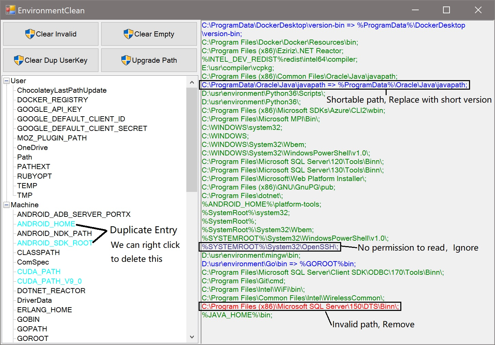

# EnvironmentClean

## 关于

这是一个小工具可以帮助清理Windows的环境变量

起因是因为我在安装软件的时候，发现他配置了环境变量，我想搞清楚他修改了哪些地方，于是打开了Windows的环境变量编辑窗口

当我看到这将近70多个条目以及1300+字符串的Path的时候，我是很崩溃的，于是我萌生了一个想要清理一下它们的念头，毕竟有不少条目是已经失效了的，这个小工具就这样诞生了

## 怎样使用

如上图所示

打开程序以后，在左边下方的列表里会列举出我们所有的环境变量，点击相应的环境变量在右边会显示其对应的值，如果左边出现了红色条目，代表该环境变量所指示的文件或文件夹已经无法访问，如果出现天蓝色条目，代表他们有重复的值，如果出现紫色，则代表这是一个空值的项。

左上方四个按钮

- 'Clear Invalid' 的功能是删除无效的环境变量 (呈红色，代表该变量指示的文件或文件夹已无法访问)
- 'Clear Empty' 的功能是删除空的环境变量 (呈紫色，代表该环境变量为空字符串或者空格)
- 'Clear Dup UserKey' 的功能是删除已经在系统环境变量下定义过了的用户变量 (例如同时在用户变量及系统变量定义了FOO，那么会删除掉用户范围下的FOO)
- 'Upgrade Path' 的功能是重新整理'Path'环境变量 (删掉无法访问的文件夹，并将可缩短的路径缩短，例如我定义了JAVA_HOME=C:\Program Files\Java\jdk999，然后在Path导出C:\Program Files\Java\jdk999\bin，那么将会把Path导出的路径缩短为%JAVA_HOME%\bin)

我 **非常不建议** 在不了解这4个按钮的功能的前提下使用它们，即便是操作会保存备份文件。建议只作为观察使用。

